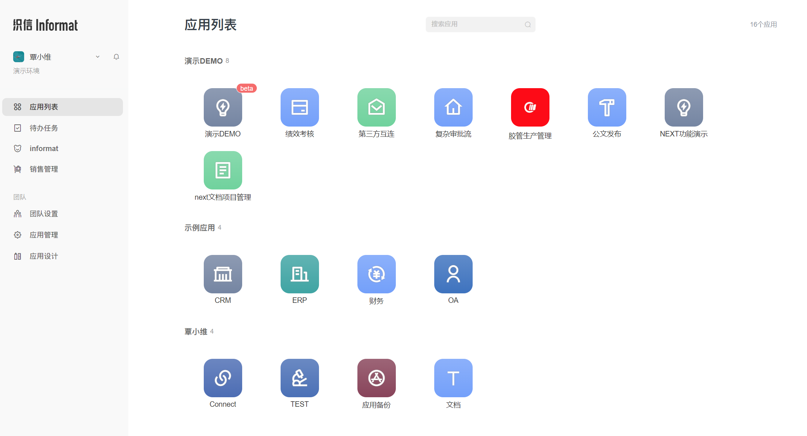
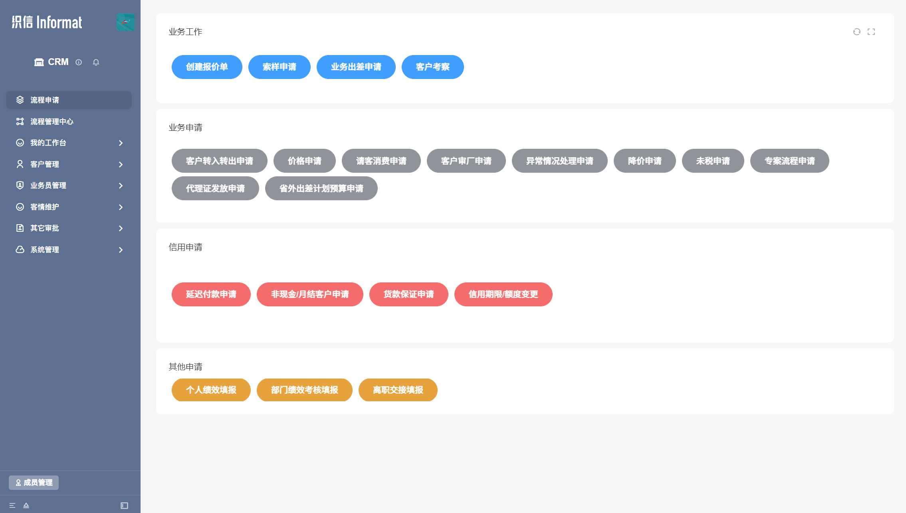
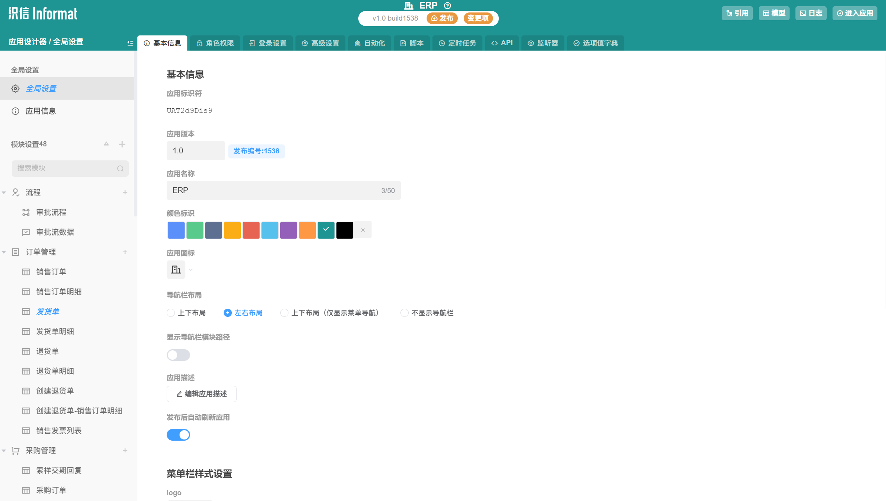

## 基础概念
在利用`织信`进行搭建应用之前，需要介绍一些基本概念。`织信`通过将程序开发中涉及到的`数据库设计`、`流程设计`、`界面设计`、`接口设计`、`程序设计`等工作抽象，使用界面配置的形式，用户可以通过拖放组件的形式实现同样的效果，这些功能在织信中称为`模块`,在您完成应用设计工作以后，织信支持将设计好的应用导出为安装包，使用安装包可以在不同的部署环境，不同客户之间进行应用分发，这一点和传统的开发模式是相同的。 织信搭建的每一个应用都以配置文件的形式存在，一个应用由多个模块组成。应用之间可以互相依赖，被依赖的应用可以设置可被外部模块访问的数据表。应用之间也可以通过`发送消息`进行通讯。 在应用搭建完毕后，需要对应用进行部署，在部署的过程中，织信会分析应用中的模块，在数据库中自动的创建应用需要的表、字段等。同一个应用可以安装多个实例，在更新应用设置后，多个实例都可以同步更新。
## 界面介绍
### 工作台

- 应用列表：显示当前登录成员拥有查看权限的所有应用入口，不同权限成员展示的应用不一样；
- 待办任务：全局待办任务入口，任务中心是宜搭应用中，与当前登录成员提交的表单或者流程数据的汇总，可以直接看见提交的表单详情，和需要处理的流程。主要包括待处理、已完成、需要我处理、指派给我和抄送我的，并支持在应页面发起所有应用内的所有流程；
- 团队设置：修改团队基础信息、成员管理、组织架构等相关设置；
- 应用管理：该页面为创建应用、应用维护、应用设计权限的入口；
- 应用设计：应用设计端入口。

### 用户端
应用的使用的前端界面、使用端。

### 设计端
用户端模块、字段、按钮功能、效果都由设计端进行配置，通过发布应用版本的方式提供成员使用。

