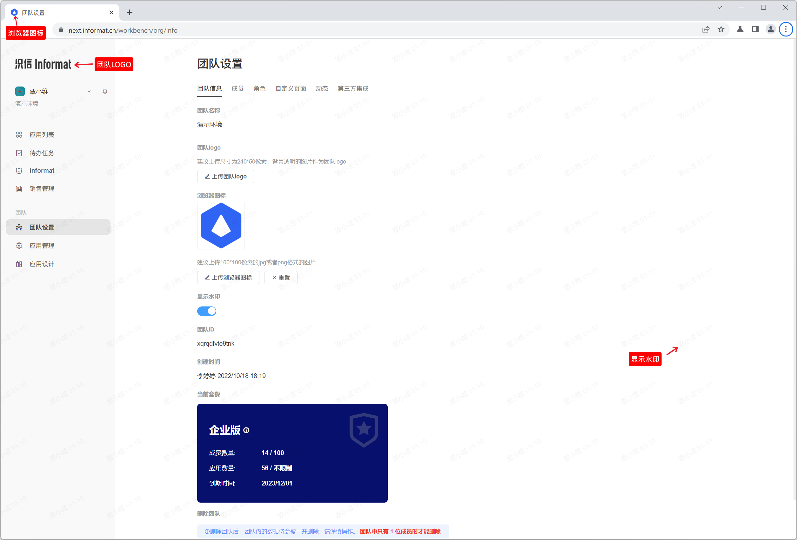
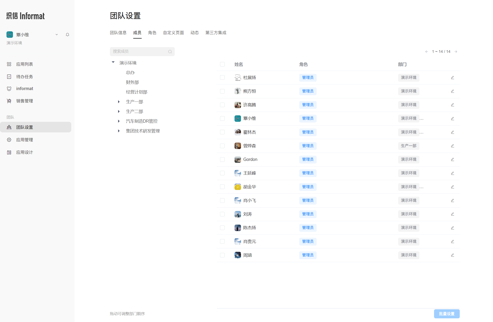
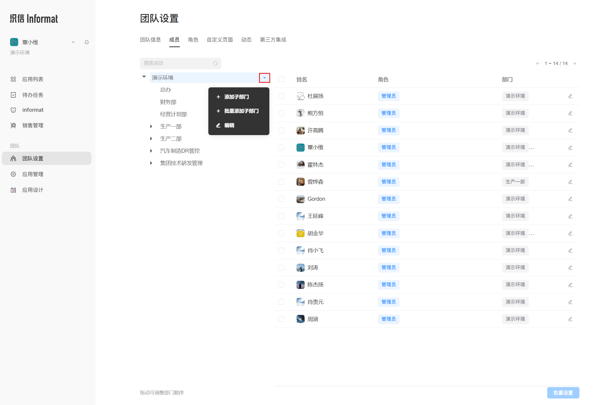
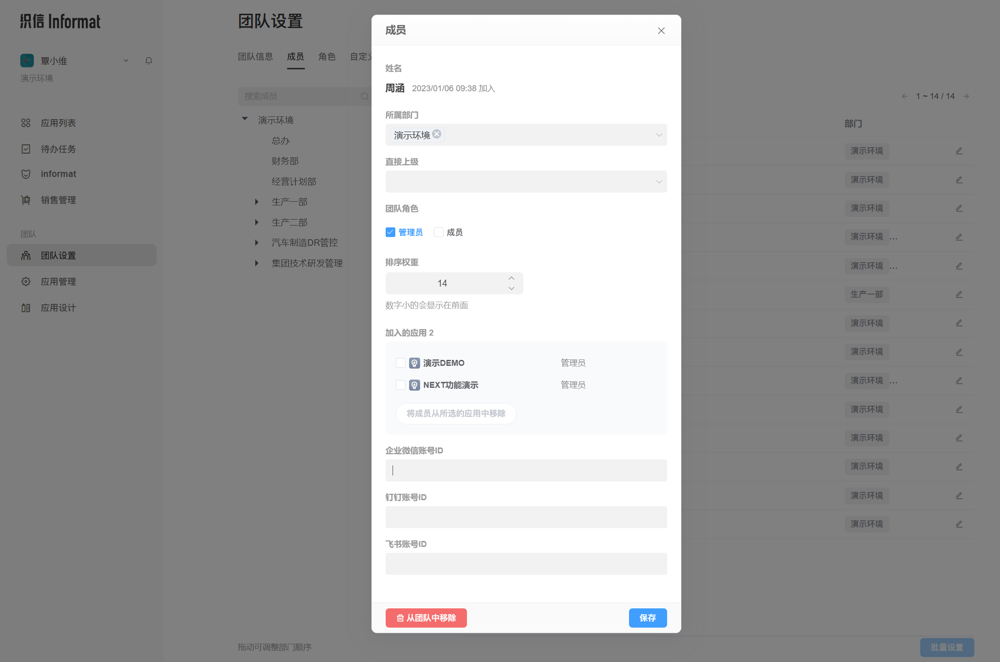

## 团队设置
平台权限、成员、对接协同办公软件等相关配置介绍。
### 团队信息
团队的基础信息查看，对界面的LOGO、浏览器图标、背景水印进行替换。

### 成员
在成员页面，可对团队的组织架构进行配置，成员管理等相关操作。

#### 部门管理
开通团队后，平台默认生成以团队为名称的根部门，管理员可在根部门下添加多级子部门或编辑部门，并支持编辑添加。

#### 成员管理

### 角色
### 自定义页面
### 动态
### 第三方集成
## 应用管理
## 应用设计